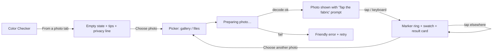
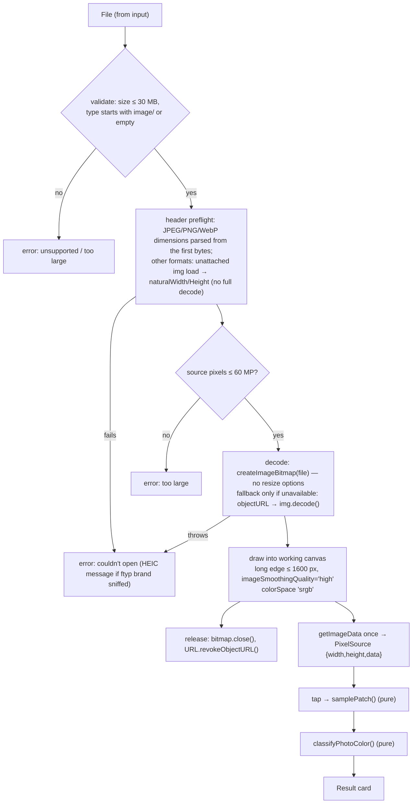
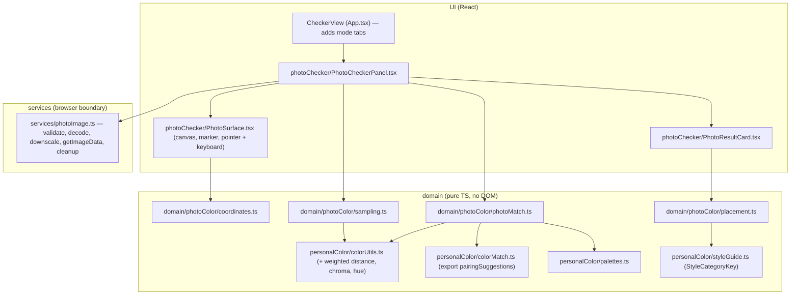

# Personal Color Pocket — V1.2 Photo Color Checker: Design Plan

Status: **design only, not implemented.** Written 2026-09-23. Baseline re-verified against released `v1.1.0` (`main` @ `53140e8`):
V1.1 changed only quiz/visual/i18n/style code. The color engine, palettes, match engine,
services, and persistence this plan relies on are identical to v1.0.0.

---

## 1. Executive Summary

A **local-only Photo Color Checker is practical with the platform APIs we already
have**, with **zero new dependencies**, **no backend**, and **no Capacitor-specific
code** for gallery selection.

- **Pipeline:** `<input type="file" accept="image/*">` → `File` → `createImageBitmap`
  (or `HTMLImageElement.decode()` fallback) → one downscaled **working canvas (≤1600 px
  long edge)** → a single `getImageData` copy → pure TypeScript sampling on tap.
- **Sampling:** a disc with a **fixed working-image radius (24 px on a 1600 px photo; changed from
  screen space by Slice 4, §8.4)**, **lightness-trimmed (drop darkest 20% and brightest 20%)**, then a mean of the
  remaining pixels. A spread metric flags patterned or mixed areas, and a clipping metric
  flags blown highlights.
- **Match model:** a new, photo-specific **categorical** classifier built on the existing
  OKLab engine and palette groups (Best / Accent / Neutral / Harder). It uses a
  **lightness-tolerant distance** because exposure is the largest photo error. **No
  percentage.**
- **The existing `checkColor()` should not be reused as-is for photos.** Measured against
  the real code (§10.1), a ~3% white-balance shift drops about 65% of exact Best colors from
  *Great* to *Good*. An exposure shift pushes most of them to *Wearable* or *Tricky*, and 74%
  of random colors rate *Tricky*. That is fine for typed HEX values but too harsh for camera
  data.
- **Honesty contract:** the feature judges *"the color as it appears in this photo,"* not
  the physical garment. It does no automatic white-balance correction.
- **Complexity: MEDIUM.** It is roughly 6 independently testable slices, and most of the risk
  is in device behaviour (decode memory, HEIC), not in the math.

**Recommendation: GO**, with a short device prototype (Slice 0) run first to confirm decode
memory and HEIC behaviour.

---

## 2. Current-Code Audit

| Area | What actually exists | Reuse for V1.2 |
|---|---|---|
| Color math | [colorUtils.ts](../src/domain/personalColor/colorUtils.ts): `normalizeHex`, `hexToRgb`, `rgbToOklab` (with correct sRGB linearization), `hexToOklab`, `colorDistance` (Euclidean OKLab), `hexColorDistance`, `readableTextColor`. `linearize` is private. | **Reuse directly.** Only add an *optional* per-axis weight for distance (§9). No new conversion math. |
| Match engine | [colorMatch.ts](../src/domain/personalColor/colorMatch.ts) `checkColor(hex, subtype)`: nearest Best/Accent/Neutral/Harder → `exp(-7.2·d)` similarity → blended score → 4 ratings. `closest` and `pairingSuggestions` are private. | Reuse **structure and pairing logic**. Export `pairingSuggestions` unchanged. **Do not change `checkColor`'s behaviour**, because the manual checker and its tests depend on it. |
| Palette data | [palettes.ts](../src/domain/personalColor/palettes.ts): 12 subtypes × `best`(8) `neutrals`(5) `accents`(5) `harder`(4) `metals`(2), with stable IDs like `warm-spring-best-1`. | **Authoritative input**. No new palette data is needed. |
| Subtype targets | [seasons.ts](../src/domain/personalColor/seasons.ts): person-level `temperature/value/chroma/contrast` targets. | **Do not use for garment matching.** These describe a *person*, not uncalibrated color coordinates (§10). |
| Types | [types.ts](../src/domain/personalColor/types.ts): `PaletteColor`, `PersonalColorPalette`, `MatchRating`, `ColorMatchResult`. | Reuse `PaletteColor`. Add new photo types in a new module rather than widening `MatchRating`. |
| Style guide | [styleGuide.ts](../src/domain/personalColor/styleGuide.ts): `StyleCategoryKey` (`tops`, `bottoms`, `shoes`, `bags`, `accessories`, `dresses`…) and `GarmentNounKey`, already localized in `copy.styleExamples.categories/garments`. It is presentation-aware (men/women). | **Reuse for placement advice** with no new garment vocabulary (§20). |
| Checker UI | `CheckerView` in [App.tsx](../src/App.tsx) (≈L578 at v1.1.0): native `<input type="color">` plus a HEX form, a result card showing `"{n}% palette fit"`, and a pairings card. | Reuse visual components/CSS (`match-result`, `pairing-grid`). Add a **mode switch** inside this view (§15). |
| Navigation | No router. `type View = 'home' \| 'presentation' \| 'quiz' \| 'result' \| 'palette' \| 'checker'` in `App`, and a 3-item `BottomNav` (My Colors / Palette / Color Checker) shown only when a result exists. | Photo checker lives **inside `checker`**. No new View and no new nav item. |
| Persistence | [persistence.ts](../src/services/persistence.ts): one versioned key `personal-color-pocket:v1` holding `{answers,result,quizStep}`, try/catch-guarded. Language and presentation use separate keys. | MVP persists **nothing new**. If history is added later, it gets its own key and stores no image data. |
| Presentation pref | [presentationPreference.ts](../src/services/presentationPreference.ts) `'women' \| 'men'`. | Filters placement suggestions (no dresses/skirts for `men`). |
| i18n | [i18n/types.ts](../src/i18n/types.ts) `LocaleCopy`, a typed object per language (`en.ts`, `th.ts`), with `colorDisplayName()` for Thai color names. | Add one typed `photoChecker` section. The type system forces TH/EN parity. |
| Ads | [ads.ts](../src/services/ads.ts) `AdPlacement` **already includes `'photo_check_bonus'`**, and `NoOpAdService.showRewarded` returns **`false`**. | ⚠ If anyone gates the photo check on `showRewarded()`, the no-op **blocks the feature**. V1.2 must not gate on ads (§19). |
| File/image handling | **None.** No file input, canvas, `createObjectURL`, or `FileReader` in `src/`. Images are static `public/` assets only. | Everything in §4 is new, but it is all browser-native. |
| Dependencies | Runtime: react, react-dom, vite, @vitejs/plugin-react, typescript. Dev: vitest, jsdom, RTL, user-event, jest-dom. | **No additions recommended.** |
| Capacitor | Not present (no `@capacitor/*`, no `android/`, no platform abstraction). | Nothing to adapt. The design only has to avoid blocking it (§5, §27). |
| Tests | Vitest + jsdom + RTL. Domain tests are colocated `*.test.ts`, and app-flow tests live in `App.test.tsx`, `presentation.test.tsx`, and `styleExperience.test.tsx`. jsdom has **no canvas implementation** and **no `createImageBitmap`**. | Pixel logic must be pure (typed arrays in, numbers out), and browser decoding must sit behind a mockable service (§17). |
| Analytics / logging | **None** (no network calls, no telemetry). | Makes the privacy claim straightforward to keep true (§13). |
| Offline | No service worker / PWA manifest. | See §13.3. |
| Structure | UI is effectively one ~660-line `App.tsx` (v1.1.0). | Put the new UI in a **new file** so App.tsx only gains a small hook-in and the photo feature's diff stays isolated. |

---

## 3. Product UX



Principles:

1. **One photo, one active sample.** Tapping again moves the marker and replaces the
   result. There is no mode and no "sample" button.
2. **The marker ring is the sample size.** The ring's diameter equals the sampled disc,
   so the user sees exactly what is measured.
3. **The result card lives directly below the photo**. It reuses the manual checker's
   visual language.
4. **Guidance is shown before the first photo** (3 short tips) and again only if a
   warning fires. It does not nag on every tap.

---

## 4. Local Image Pipeline



Key decisions:

- **Decode path:** prefer `createImageBitmap(file)`. It decodes off the main thread in
  Chromium and applies EXIF orientation by default (`imageOrientation: 'from-image'`).
  **Changed by Slice 0:** do *not* pass `resizeWidth`/`resizeHeight`. Chromium 153 honours
  them, but peak memory stayed the same as a full decode (48 MP: +265 vs +260 MiB) and decoding
  was slower. Enforce the 60 MP cap with a cheap header-only dimension probe *before* decoding.
  `URL.createObjectURL` + `HTMLImageElement.decode()` is used only where `createImageBitmap` is
  missing, because Chromium keeps `` decodes in its image cache after cleanup
  (+105–186 MiB retained). See §22.
  **Implemented in Slice 3** ([record](V1_2_SLICE_3_IMAGE_PIPELINE.md)): the preflight parses
  JPEG/PNG/WebP headers directly, and uses the `` probe only for other formats (HEIC on
  Safari, AVIF, GIF) so the cap is never skipped. The `` fallback also runs when
  `createImageBitmap` rejects with `TypeError`/`NotSupportedError` (it cannot take a Blob).
  Any other decode failure is final, with no second decoder.
- **Superseded by Slice 3:** the service's canvas is temporary and zeroed once the pixels are
  read. Slice 4 paints the returned pixels into its own display canvas with
  `putImageData(new ImageData(data, w, h))`, which wraps the buffer without copying it.
  The retained total is the same, and the preview shows exactly the sampled pixels.
  Original text: **The working canvas doubles as the preview.** The same canvas is displayed with CSS
  `width:100%; height:auto`. There is no second copy and no long-lived object URL.
- **Read pixels once.** One `getImageData(0,0,w,h)` after drawing. Every tap samples the
  retained `Uint8ClampedArray`, which keeps sampling pure and makes it unit-testable. It also
  avoids `willReadFrequently` concerns.
- **Nothing leaves memory.** No `fetch`, no storage, no worker message to anywhere but
  the page.

---

## 5. Mobile Gallery / Capacitor

### A. Mobile browser
- `<input type="file" accept="image/*">` **without** `capture`. On Android Chrome this opens
  the system chooser, which on recent Android versions is the **system Photo Picker**, with
  gallery, files, and camera. On iOS Safari it offers Photo Library / Take Photo / Choose File.
- **No permission prompt is needed.** The picker grants access only to the chosen file.
- Trigger it from a real `<button>` that calls `input.click()`, or a styled `<label>`, and
  keep the input visually hidden but accessible. Reset `input.value = ''` after each
  selection so re-choosing the same photo still fires `change`.

### B. Capacitor Android (future)
- Capacitor's Android `BridgeWebChromeClient` implements `onShowFileChooser`, so a
  plain file input works inside the WebView **without a plugin**. It returns a `content://`
  URI that the WebView exposes to JS as an ordinary `File`, so our code never sees file URIs.
- **Do not request `READ_MEDIA_IMAGES` / `READ_EXTERNAL_STORAGE`.** They are not needed, and
  Google Play restricts broad media permissions for apps that only need one-off picks.
- `@capacitor/camera` (`getPhoto` / `pickImages`) would add native code and a permission
  surface for no benefit here. **Not recommended.** Revisit only if Slice 0 shows the
  WebView picker misbehaving on a target device.
- **Result: one shared implementation for web and Android.** Keep the decode entry point
  (`openPhoto(file: File)`) in a service so a native fallback could be slotted in later
  without touching UI or domain code.

---

## 6. Image Format Compatibility

| Format | Behaviour | V1.2 action |
|---|---|---|
| JPEG | Universal. EXIF orientation applied by modern browsers' `createImageBitmap`/``/`drawImage(img)`. | Supported. |
| PNG / screenshots | Universal. May have alpha. | Supported. Transparent pixels are excluded when sampling (§10). |
| WebP | Chrome/Android WebView/Safari 14+/Firefox. | Supported. |
| **HEIC/HEIF** | **iOS Safari:** the picker usually hands the page a transcoded JPEG, and recent Safari decodes HEIC natively anyway, so it works. **Android Chrome / Android WebView (Chromium):** Chromium does not decode HEIC, so an iPhone-originated `.heic` file that reached an Android device unconverted **will fail to decode**. Many transfer routes (Google Photos downloads, messaging apps) already convert to JPEG. Some Samsung devices can be set to shoot HEIF. | **No HEIC library in V1.2.** A WASM decoder (e.g. libheif-based) costs roughly 1–2 MB+, adds licensing and maintenance work, and adds decode memory on low-end phones, all for a minority case. **Slice 0 decision (option A):** always *attempt* decode. Never reject by name or MIME, because a JPEG labelled `.heic` / `image/heic` decoded fine: browsers sniff the content. On decode failure, sniff bytes 4–12 for an `ftyp` HEIF brand (`heic`/`heix`/`mif1`/`msf1`/`heif`) and show the **specific friendly message**: *"This photo format (HEIC) can't be opened here. Try a screenshot of the photo, or save it as JPEG."* Otherwise show the generic decode error. A real HEIC on an Android device still **requires a physical-device test**. |
| AVIF | Chromium and modern Safari decode it. | Supported where the browser decodes it; otherwise it falls into the generic decode error. |
| GIF / SVG | GIF decodes (first frame). SVG is an image type, but sampling vector art is not meaningful, and SVG can reference external resources. | Reject `image/svg+xml` explicitly. Allow GIF silently. |
| Wide-gamut (Display-P3) / ICC | Browsers color-manage decoded images into the canvas color space. A default 2D canvas is sRGB, so P3 values are converted or clipped to sRGB. | Request `getContext('2d', { colorSpace: 'srgb' })` explicitly for determinism. The palette is sRGB HEX anyway, so this is the *correct* space to compare in. |
| Huge / odd aspect | See §7. | Caps + a friendly error. |

---

## 7. Performance / Memory

**Sampling does not need full resolution.** We want the *average fabric color over an
area the size of a fingertip*. Downscaling is a low-pass filter that suppresses weave
texture and JPEG noise, so it *helps*.

| Item | Budget |
|---|---|
| Working/preview canvas | **long edge ≤ 1600 px**. Worst case about 1600×1600 = 2.56 MP = **~10 MB RGBA**; typical 4:3 1600×1200 ≈ 7.7 MB. At 390 CSS px width on a 3× DPR phone that is 1170 device px, so 1600 px stays sharp. |
| Retained `ImageData` | Same size again: **~8–10 MB**. |
| Transient decode | Full-size bitmap if the decoder can't downscale. 12 MP ≈ 48 MB, **48 MP ≈ 192 MB**, which is the main memory risk. Released immediately via `bitmap.close()`. |
| Per-tap sampling | Disc of r≈15–25 px is roughly 700–2000 pixels, each with one `rgbToOklab`. **< 2 ms** on a mid phone. |
| Decode latency | 12 MP JPEG is typically about 100–400 ms on mid-range Android. Show a "Preparing photo…" state. |

Safeguards:
- Reject files **> 30 MB** before decoding. Reject sources **> 60 MP** (width×height, read
  by the header probe *before* the full decode, per Slice 0),
  with copy suggesting a screenshot or smaller copy. Most phones save 12 MP (binned) by
  default, and 48–200 MP only in "high-res" modes.
- Keep canvas dimensions under iOS Safari's canvas area limit (about 16.7 MP). 1600² is far below it.
- **Cleanup:** `bitmap.close()` right after drawing. `URL.revokeObjectURL()` in the
  fallback path right after `decode()`. On "choose another photo" or unmount, drop the
  `ImageData` reference and set `canvas.width = canvas.height = 0` (iOS releases canvas
  backing stores lazily otherwise).
- A Web Worker / `OffscreenCanvas` is **not needed** for V1.2. Decode is already
  async in `createImageBitmap`, and sampling is trivial.

---

## 8. Sampling Algorithm

### 8.1 Why not one pixel
One pixel of a fabric photo is some mix of weave/knit shadow, fibre highlight, JPEG 8×8 block
and chroma-subsampling error (chroma is typically stored at half resolution), sensor noise,
stitching, and pattern. Neighbouring pixels on a plain cotton tee routinely differ by
ΔE_OK ≈ 0.03–0.08, which is the same size as the gap between two adjacent palette colors
(median nearest-neighbour distance within a palette is **0.045**, measured in §10.1). A single
pixel therefore changes the *answer*, not just the decimals.

### 8.2 Options compared

| Approach | Robust to highlight/shadow | Robust to noise | Pattern-aware | Cost | Verdict |
|---|---|---|---|---|---|
| A. Mean RGB | ✗ (a specular glint drags it light) | ✓ | ✗ | trivial | Insufficient alone |
| B. Per-channel median RGB | ~ | ✓ | ✗ | sort ×3 | Can yield a color no pixel had (channels chosen independently) |
| C. Trimmed mean | ✓ if trimmed on the right axis | ✓ | ✗ | sort once | **Good** |
| D. Median in OKLab | ✓ | ✓ | ✗ | sort ×3 | Same channel-mixing caveat as B |
| E. k-means / dominant clusters | ✓ | ✓ | ✓ | iterative, needs k and seeding | Overkill for V1.2 |
| F. Center-weighted | – | ✓ | slight | trivial | Marginal when the disc is small |
| G. Reject extremes | ✓ | – | ✗ | – | Needed |
| **H. G + C on the lightness axis + spread check** | ✓ | ✓ | detects, doesn't resolve | one sort | **Recommended** |

### 8.3 Recommended V1.2 algorithm (`samplePatch`)

```
input:  PixelSource {width, height, data: Uint8ClampedArray (RGBA)}, center (x,y), radius r
1. Collect pixels inside the disc (x−cx)²+(y−cy)² ≤ r², clipped to image bounds.
2. Drop pixels with alpha < 250 (transparent PNG / screenshot edges).
   If kept < 50% of the in-bounds disc → result: { kind: 'no-color', reason: 'transparent' }.
   If the disc lies < 50% inside the image (edge tap) → still sample what's inside.
3. For each pixel compute OKLab via existing rgbToOklab().
4. Sort by L. Keep the central band: drop the lowest 20% (shadow, creases, stitching gaps)
   and the highest 20% (specular highlights, lint, glare).
5. Representative color = mean of the kept pixels' 8-bit sRGB channels → round → HEX
   → hexToOklab() for everything downstream.
6. Quality metrics over the kept pixels:
   spread   = RMS OKLab distance of kept pixels from the representative color
   clipped  = fraction of ALL disc pixels with any channel ≥ 250 or all channels ≤ 5
7. Flags:
   spread  > SPREAD_WARN  (initial 0.045) → 'mixed'  (pattern / print / edge of garment)
   clipped > 0.35                          → 'exposure' (blown highlight or crushed shadow)
output: { hex, oklab, pixelCount, spread, clipped, flags[] }
```

Why this one:
- **Lightness is the axis that highlights and shadows corrupt.** They are mostly *luminance*
  errors on a given fabric. Trimming on L removes them without using a hue order, which
  doesn't exist.
- **Averaging the survivors** keeps a physically plausible single color (unlike per-channel
  medians). It also uses the existing conversion functions, so there is **no new color math**.
  (Averaging in gamma-encoded sRGB instead of linear light biases very slightly dark. For a
  trimmed, near-uniform set the difference is ≪ 0.01 ΔE_OK, which is negligible next to
  lighting error, §12.)
- It is **deterministic** (the same pixels always give the same HEX), about 60 lines, one sort, and trivially testable with
  synthetic arrays.
- Pattern handling is **detection, not resolution** (§11), which is the right V1.2 scope.

All thresholds are named constants in one module, calibrated in Slice 0/1 fixtures, and
never inlined.

**Implemented in Slice 1** as `samplePhotoRegion()` in `src/domain/photoColor/sampling.ts`. The frozen
contract and its deviations from the sketch above are in [V1_2_SLICE_1_SAMPLING_ENGINE.md](V1_2_SLICE_1_SAMPLING_ENGINE.md).
In short: the single `exposure` flag is split into `highlight` / `shadow`, and a pixel only counts as clipped
when **all** channels are clipped, so saturated fabric is not flagged. Clipping fractions are over opaque
pixels. Results are a typed union, so there is `unavailable` with the reasons `outside-image`,
`transparent` and `insufficient-pixels` (< 5 opaque pixels).

### 8.4 Region size rule

The sample should cover **what the user's finger meant**, which is a screen-space quantity. It must
still stay meaningful whatever the working resolution or the rendered size.

```
scale      = workingImage.width / renderedRect.width          // image px per CSS px
r_image    = round(SAMPLE_RADIUS_CSS · scale)                 // SAMPLE_RADIUS_CSS = 14
r_image    = clamp(r_image, 3, round(0.04 · min(width, height)))
```

- A fixed number of *intrinsic* pixels (e.g. "25×25") means a different fabric area for every
  photo resolution and display size. That rule is rejected.
- A pure percentage of the image ignores how large the photo is on screen. It is used only as the
  upper **cap**, so a thumbnail-sized render of a wide photo can't average across half the garment.
- The floor of 3 px guarantees ≥ ~29 pixels for trimming statistics.
- Example: a 1600×1200 working image rendered 390 CSS px wide gives scale ≈ 4.1 and r ≈ 57, capped
  to 48 px. The marker ring is drawn at `r_image / scale` CSS px, so what you see is what is sampled.
- Zoom is not in V1.2. If added later the same formula still holds, because `renderedRect` grows
  and the radius shrinks in image space.

**Changed by Slice 4** ([record](V1_2_SLICE_4_INTEGRATION_COORDINATES.md) §9): the radius no longer
depends on the preview size. It is `max(3, min(24, round(0.04 · min(width, height))))` in working-image px.
- Every downsized photo gets 24 px, the Slice 1 default: the same share of the photo on every screen.
- Small images get the 4% cap.
- Slice 0 §8 showed that the cap always bound on phones, so the screen term only ever shrank the disc on
  large displays, and a small preview could no longer inflate it.
- The marker ring is drawn at `24 / scale` CSS px, so it still shows exactly what is sampled.

---

## 9. Color Science / Existing Engine Reuse

Pipeline, reusing the **actual** functions:

```
getImageData (sRGB, 8-bit)  ──►  rgbToOklab()  [colorUtils — already linearizes sRGB correctly]
                               │
                               ▼
                 trimmed mean → HEX (normalizeHex format "#RRGGBB")
                               │
                               ▼
      hexToOklab()  ──►  photo distance: colorDistance with lightness weight kL = 0.5
                               │
                               ▼
               classifyPhotoColor(oklab, subtype) using getPalette(subtype)
```

The only engine changes proposed (additive, and they don't change existing behaviour):

1. `colorUtils.ts`: add `weightedColorDistance(a, b, { l: number })`, or an optional
   third parameter on `colorDistance` that defaults to `1`, so every existing call stays
   byte-identical.
2. `colorUtils.ts`: add `oklabChroma(c)` = `hypot(a,b)` and `oklabHue(c)`, two one-liners used by
   descriptors. No inverse transform (OKLab→sRGB) is needed, because the representative
   color is produced in sRGB.
3. `colorMatch.ts`: `export` the existing `pairingSuggestions`. No logic change.

Nothing duplicates `rgbToOklab`, `linearize`, or `normalizeHex`.

---

## 10. Match Model

### 10.1 Evidence from the current engine (measured, not assumed)

A throwaway script (outside the repo) ran the **real** `checkColor` and palettes against
each subtype's 96 Best colors under simple simulated lighting (per-channel scaling in
linear light):

| Condition | Median ΔE_OK shift | Exact Best colors that remain "Great Match" |
|---|---|---|
| Warm cast (R×1.08, B×0.82) | 0.017 | **27 / 96** (68 → Good, 1 → Wearable) |
| Cool cast (R×0.92, B×1.12) | 0.014 | 40 / 96 |
| Shadow (×0.55 exposure) | 0.114 | 3 / 96 (24 → *Tricky*) |
| Bright (×1.35 exposure) | 0.062 | 2 / 96 |
| Random sRGB colors (4000) | – | 74% Tricky, 21% Wearable, 5% Good, 0.2% Great |

Other findings:
- The whites and blacks that users really photograph (white shirts, black jeans) often rate
  *Tricky* for subtypes where "Optic White" or "Black" is in `harder`, which is intended.
  Mid-grey `#808080` also rates *Tricky* for 7 of 12 subtypes, which is not a helpful message
  for a grey sweater.
- `checkColor`'s *Tricky* reason names the **nearest Harder color even when it is far away**,
  so a mid green could be explained as "closer to Black".
- 26% of other subtypes' Best colors sit closer to a given subtype's Harder group than to its
  positive groups. The Harder list (4 colors) is a set of *examples*, not a boundary.
- **Lightness-tolerant distance** (`kL = 0.5`) cuts exposure drift roughly in half: shadow p50
  0.059 → 0.034, bright 0.043 → 0.025. Discrimination on random colors drops only a little
  (random → nearest-positive p25 0.078 → 0.064).

Conclusion: `checkColor` suits exact user-chosen HEX values. Photo input needs its own
classifier with tolerance for exposure and a Harder guard that requires the color to be
**close**, not just comparatively nearer.

### 10.2 Models considered

| Model | Strength | Weakness |
|---|---|---|
| A. Nearest Best only | Simple | Ignores neutrals (the most-photographed garments) and Harder |
| B. Distance to all 4 groups | Uses the whole curated data. Explainable ("closest to *Camel*, one of your neutrals") | Needs lighting tolerance and absolute thresholds |
| C. Dimensional vs `seasonDefinitions.target` | Sounds principled | Targets are **person** quiz dimensions on a 0–1 scale with no calibrated mapping from garment OKLab. It would invent a model |
| D. Hybrid palette + dimensions | Can explain *why* | Needs a dimension basis. The palette's own OKLab range is data-derived; C's targets are not |
| **E. B + palette-relative dimension explanations** | Deterministic, uses only curated data, explains direction of mismatch | Thresholds need fixture calibration (a one-time task) |

### 10.3 Recommended: Model E — "nearest relationship"

```
input:  sample OKLab s, subtype
d(x,y)  = sqrt( (0.5·ΔL)² + Δa² + Δb² )                       // kL = 0.5
for g in {best, accents, neutrals, harder}: n_g = argmin d(s, c), c ∈ palette[g]
pos     = min over {best, accents, neutrals}    (with its group and color)
T_CLOSE = 0.045   T_RELATED = 0.085                           // initial; calibrate in Slice 2

category =
  pos.d ≤ T_CLOSE and pos.group ∈ {best, accents}   → 'near-face'      "Great near your face"
  pos.d ≤ T_CLOSE and pos.group = neutrals          → 'neutral-base'   "Easy neutral"
  harder.d ≤ T_CLOSE and harder.d < pos.d           → 'away-from-face' "Better away from your face"
  pos.d ≤ T_RELATED and pos.d ≤ harder.d            → 'related'        "Works with care"
  harder.d ≤ T_RELATED and harder.d < pos.d         → 'away-from-face'
  otherwise                                         → 'outside'        "Outside your palette"
```

Explanation fields:
- `nearest`: the nearest positive color with its group, e.g. *"Closest to **Warm Coral** — one of your
  Best colors."* It is always shown, even for 'outside', so the user gets something concrete.
- `resembles`: the Harder color, **only if** `harder.d ≤ T_RELATED`. This fixes the far-away "closer
  to Black" message.
- `direction` (for `related` / `outside` / `away-from-face`): compare `s` with `nearest`
  on three **relative** axes, and report up to the 2 largest that exceed a small threshold:
  - lighter / deeper: ΔL beyond ±0.06
  - brighter / more muted: Δchroma beyond ±0.03
  - warmer / cooler: hue rotation toward yellow-orange (~70°) or toward blue (~260°) beyond ±12°,
    only when both chromas are > 0.04

  *"A bit deeper and more muted than your closest palette colors."*
- Why the temperature axis is **relative**: checked against the real palettes, an absolute rule
  like "OKLab b > 0.02 ⇒ warm" labels 3–5 of Warm/Clear Spring's own Best/Accent colors
  (teals, blues) as "cool". An absolute warm/cool label on a single color is not reliable,
  but "cooler than *your* nearest color" is.
- **Metals are excluded** from matching. Photographed metallic or shiny surfaces are
  specular and unreliable. Show the "shiny/metallic surfaces read unreliably" tip instead.

This avoids binary good/bad in several ways. An 'outside' color still gets placement advice and
companions. A neutral is its own positive category. 'away-from-face' names a specific
similar Harder color instead of a verdict.

**Implemented in Slice 2** as `matchPhotoColor(sample, subtype)` in `src/domain/photoColor/photoMatch.ts`.
Details and calibration are in [V1_2_SLICE_2_PHOTO_MATCH_ENGINE.md](V1_2_SLICE_2_PHOTO_MATCH_ENGINE.md).
`T_CLOSE`, `T_RELATED` and `kL` were kept at the values above.

Durable clarifications:
1. A positive color wins "close" only if it is at least as near as the nearest Harder color.
2. The distance splits Δa/Δb into ΔC and ΔH. The hue term is weighted 0 when the less chromatic color has
   chroma ≤ 0.01, and 1 when it has chroma ≥ 0.02. For chromatic colors this is exactly the formula above,
   but grey/white/black samples can no longer change their answer with hue noise. The distance therefore
   lives in `photoMatch.ts`, and `colorUtils` only gained `oklabChroma`, `oklabHue` and `hueDifference`
   (no `weightedColorDistance`).
3. `placement.ts` moves to Slice 5, because it needs the presentation preference and copy. Its inputs,
   `category` and `nearest.group`, are already in the result.

### 10.4 What is *not* claimed
- Nothing about the physical garment, only the photographed color (§12).
- No probability or percentage (§11.2).
- Thresholds are *curation-consistent* (calibrated so each subtype's own palette colors
  classify correctly under mild lighting shifts). They are not validated against human
  judgments, and the copy says "app estimate".

---

## 11. Result UX

### 11.1 Hierarchy (mobile, top to bottom)

**Always visible**
1. Photo with the marker ring (the sampled area).
2. **Swatch + HEX**, e.g. `#D46B4F`. The HEX can be copied. The swatch text color uses
   `readableTextColor`.
3. **Category label** (text + icon, never color alone): *Great near your face / Easy neutral /
   Works with care / Better away from your face / Outside your palette.*
4. **One reason line** built from `nearest` / `resembles` / `direction`, with a mini swatch of
   the referenced palette color.
5. **Wear it as:** 2–4 placement chips (§20).
6. A small fixed caption: *"Based on how this color appears in this photo."*
7. A warning banner **only if** a flag fired (`mixed`, `exposure`), with a one-line fix.

**Under "More details" (`<details>`)**
- Descriptors: *Light / Medium / Deep* (L ≥ 0.72 / ≤ 0.45), *Soft / Moderate / Clear*
  (chroma < 0.06 / > 0.13), and relative temperature if applicable.
- The closest color in each group (Best / Accent / Neutral), with group labels.
- *Try it with*: the `pairingSuggestions` result (reused).
- The photo tips list.
- An "Open in manual checker" link that pre-fills the HEX (cheap and useful: the typed-HEX
  path then shows the existing detailed result).

### 11.2 No percentage
The existing manual checker shows `"{n}% palette fit"` from `exp(-7.2·d)`. That number is a
monotone transform of a distance, **not calibrated against any observation**. For photo input it
also swings ±20 points with exposure (§10.1). A precise-looking number on an imprecise
measurement is misleading, so **the photo checker shows categories only.** Whether to remove
the percentage from the *manual* checker is a separate decision and out of V1.2 scope
(Open Question Q4).

---

## 12. Lighting / Accuracy Limitations

A photo records *light reflected from the fabric, as interpreted by the camera's auto white
balance, auto exposure, tone curve, HDR merge, and any filter*. The same shirt photographed
indoors under 2700 K bulbs and outdoors in shade can differ by more than the gap between two
neighbouring palette colors.

**The product may claim:**
- "This is the color **as it appears in this photo**."
- "Compared with your palette, this photographed color is closest to *X*."
- "Your photo stays on this device."

**The product must not claim:**
- "This garment is color *X*" / "This garment suits you" / "Accurate color measurement".
- Any percentage or "scientific" framing.
- That it corrects for lighting.

**Guidance copy (shown before the first photo; the first two repeat in the exposure warning):**
- Photograph in daylight near a window. Avoid lamps and colored light.
- Turn off filters and beauty effects.
- Tap a flat, evenly lit area, not folds, shadows or shine.
- Plain fabric works best. For prints, tap the main color.

### 12.1 White-balance correction — decision

| Option | Assessment |
|---|---|
| A. None | Honest. Camera AWB is already a correction, and in daylight it is usually decent. |
| B. Manual neutral reference ("tap something white/grey") | Useful only if the user taps a truly neutral, equally lit object. Cream walls, ivory paper and "white" shirts are not neutral, so it silently mis-corrects, and it doubles the interaction and the copy. |
| C. Automatic (gray-world / white-patch) | **Actively harmful for this use case.** Garment photos are *dominated by the garment*, so gray-world treats the garment's own color as the cast and neutralizes it. White-patch picks up highlights. |
| D. Future | Revisit B together with a printed or known reference card, if users ask. |

**V1.2: A (no correction) + guidance + honest framing.** B is deferred. C is rejected.

---

## 13. Privacy / Security

### 13.1 Privacy verification

| Question | Answer under this design |
|---|---|
| Do image bytes leave the device? | **No.** No network code exists in the app, and the design adds none. `File` → decode → canvas all happen in-page. |
| Analytics / error logging? | None exist today. **Rule:** any future analytics or crash reporter must never receive `File`, blob URLs, `ImageData`, file names or EXIF, only enum events (e.g. `photo_check_result: 'near-face'`). Add a code comment and a test (§17) guarding this. |
| Object URLs | `blob:` URLs are origin-local and not network resources. We revoke them right after decode (fallback path only). |
| localStorage | **Never store image data or file names.** The MVP stores nothing new. |
| EXIF (GPS, device) | Never read. The canvas redraw discards metadata, and the `File` reference is dropped after decode. |
| Canvas tainting | Local blobs are same-origin, so `getImageData` works. No CORS images are involved. |

The statement **"Your photo stays on this device. It isn't uploaded or saved."** is truthful for
this design, with the Slice 6 checklist verifying it (DevTools Network panel shows no requests
during a check, and Application → Storage shows no new keys).

### 13.2 Security safeguards (proportional)

| Risk | Safeguard |
|---|---|
| Huge file / decompression bomb | 30 MB file cap before decode. 60 MP cap checked by header probe before decode. Decode in try/catch. `createImageBitmap` rejects malformed data instead of hanging. |
| Unsupported / mislabeled MIME | Don't trust `file.type`. Rely on decode success. Reject `image/svg+xml`. |
| Memory leaks | `bitmap.close()`, `revokeObjectURL`, zero-size canvas on reset or unmount. The effect cleanup is tested. |
| File name exposure | Not rendered, not stored. |
| Unsafe HTML | All output goes through React text nodes. No `dangerouslySetInnerHTML`. |
| Persisted image data | None by design. |
| Pixel-coordinate abuse | Pure clamp to image bounds in the sampler, which is unit tested. |

### 13.3 Offline
- The photo checker has **no network dependency**. Once the JS bundle is loaded it works
  with the network off, in the same tab.
- The **web** app has no service worker, so a cold reload while offline fails. That is a
  separate PWA decision and should not be added in V1.2.
- **Capacitor** bundles the assets locally, so it is fully offline.

---

## 14. Accessibility / Localization

### 14.1 Accessibility
- **The result never relies on color perception.** It always shows the HEX, the category
  *text*, descriptor words (light/deep, soft/clear), and palette color *names*.
- **Keyboard / switch equivalent to tapping.** The photo surface is a focusable element
  (`tabIndex=0`, `role="group"`, `aria-label="Photo. Use arrow keys to move the sample point,
  Enter to check."`). Arrow keys move the marker by 2% of the image width (Shift for 10%),
  Enter/Space samples. The marker starts at the image center on first focus.
- `aria-live="polite"` on the result summary (the category + reason sentence only, so
  screen readers aren't flooded).
- The file-picker trigger is a real `<button>` with a clear label, and targets are ≥ 44×44 px
  (matching existing `.answer-option` min-heights).
- Focus handling: after a photo loads, move focus to the photo surface. After "choose another
  photo" fails or is cancelled, return focus to the picker button.
- Warnings use text + icon and are included in the live region.
- Marker ring: a two-tone (white + dark) outline, so it stays visible on any fabric color.

### 14.2 Localization structure
Add **one** typed section, `LocaleCopy['photoChecker']`, so the compiler enforces TH/EN parity:

```ts
photoChecker: {
  modeTabs: { manual: string; photo: string; aria: string }
  empty:    { title: string; body: string; choose: string; privacy: string }
  tips:     { heading: string; items: [string, string, string, string] }
  status:   { preparing: string; tapPrompt: string; keyboardHint: string; surfaceLabel: string }
  actions:  { another: string; openInManual: string; moreDetails: string }
  errors:   Record<'unsupported' | 'heic' | 'tooLarge' | 'decodeFailed' | 'transparent', string>
  warnings: Record<'mixed' | 'exposure', string>
  categories: Record<PhotoMatchCategory, { label: string }>
  reason: {                                    // functions, like existing matchReason
    nearest: (color: string, group: PaletteGroupLabel) => string
    resembles: (color: string) => string
  }
  direction: Record<'lighter' | 'deeper' | 'brighter' | 'muted' | 'warmer' | 'cooler', string>
  join: (parts: string[]) => string           // TH/EN list joining differs
  descriptors: { value: Record<'light'|'medium'|'deep', string>; clarity: Record<'soft'|'moderate'|'clear', string> }
  groupLabels: Record<'best' | 'accents' | 'neutrals', string>   // may reuse palette.sections titles
  wearAs: string
  appearsCaption: string
}
```

That is about 50 strings per language. **Placement chips reuse** `copy.styleExamples.categories`
and **color names reuse** `colorDisplayName()`, so there is no new garment or color vocabulary.

---

## 15. Navigation Integration

The current IA is a 3-item bottom nav: *My Colors / Palette / Color Checker*. The checker page
already answers "does this color suit me?", and a photo is simply another way to *input* the color.

**Smallest change:** add a segmented control at the top of the existing `CheckerView`,
*[ Pick a color | From a photo ]*, reusing the existing `.palette-tabs` pattern
(`role="tablist"`). Details:
- No new `View`, no new nav item, no router.
- `View` stays `'checker'`. The mode is local state in the view, and it resets to "Pick a color" on
  re-entry because photo state is ephemeral. Persisting the chosen *mode* (not the photo) under a
  tiny key is optional.
- It fits the likely future *My Colors / Checker / Learn* structure unchanged.
- Consider renaming the nav label *Color Checker* → *Checker* only if TH text overflows.
  Not required.

---

## 16. Proposed Architecture



| Module | Responsibility | Depends on | Must not |
|---|---|---|---|
| `domain/photoColor/coordinates.ts` | **As built in Slice 4:** `fitContain(image, container)`, `displayToImage(point, imageRect, image)` → image point or `outside-displayed-image`, `imageToDisplay`, `imageLengthToDisplay`, `sampleRadiusFor(image)`. The keyboard nudge step is left to the UI. | `sampling` (default radius) | touch DOM types beyond plain `{x,y,width,height}`, or use DPR |
| `domain/photoColor/inspect.ts` | **Slice 4:** `inspectPhotoTap(image, tap, subtype)` / `inspectPhotoPoint(image, point, subtype)` → `outside-displayed-image` \| `unavailable` \| `matched {sample, match}`. Glue only. | `coordinates`, `sampling`, `photoMatch` | contain colour math, infer the subtype |
| `domain/photoColor/sampling.ts` | `samplePatch(source, center, radius)` → `PhotoSample`. Thresholds live here as named constants. | `colorUtils` | know about canvas or File |
| `domain/photoColor/photoMatch.ts` | `classifyPhotoColor(sample.oklab, subtype)` → `PhotoMatchResult` {category, nearest, resembles?, direction[], descriptors, pairWith} | `colorUtils`, `palettes`, `colorMatch.pairingSuggestions` | be imported by `scoring.ts` / `diagnostics.ts` (same isolation rule as `styleGuide.ts`) |
| `domain/photoColor/placement.ts` | `placementsFor(category, group, preference)` → `StyleCategoryKey[]` | `styleGuide` types | contain prose |
| `domain/photoColor/types.ts` | `PixelSource`, `PhotoSample`, `SampleFlag`, `PhotoMatchCategory`, `PhotoMatchResult` | `personalColor/types` | – |
| `services/photoImage.ts` (+ pure `photoImageHeader.ts`) | **As built in Slice 3:** `openPhoto(file, { signal? }) → Promise<PixelSource>`, which rejects with `PhotoImageError { code }`. The codes are `file-too-large`, `image-too-large`, `invalid-image`, `unsupported-format`, `unsupported-heic`, `decode-failed`, `canvas-failed` and `aborted`. It retains nothing: no `drawTo`/`dispose` (see §4) | browser APIs only | import domain matching, persist anything, log |
| `photoChecker/*.tsx` | UI state machine: `idle → preparing → ready(sample?) → error` | the above + i18n | do color math inline |

Dependency direction is `UI → services / domain/photoColor → domain/personalColor`, never the
reverse. `domain/personalColor` stays unaware that photos exist.

Why a new `src/photoChecker/` folder instead of adding to `App.tsx`: App.tsx is already
~660 lines and holds every existing view. A separate folder keeps the photo feature's diff
isolated. App.tsx gains roughly 10 lines: an import, the mode tabs, and rendering the panel.

---

## 17. Test Strategy

jsdom has no canvas and no `createImageBitmap`. The architecture makes that irrelevant:
**all pixel logic takes `Uint8ClampedArray`**, and UI tests `vi.mock('../services/photoImage')`.

**Unit (pure, fast)**
- `coordinates`: CSS→image mapping at 1×/3× DPR, letterboxed/scaled canvases, edge clamping,
  radius mapping (14 CSS px on a 390 px-wide 1600×1200 image → 57 px → capped to 48), keyboard nudge
  bounds.
- `sampling` with synthetic fixtures built in-test (helper `makePixels(w,h,fn)`):
  - uniform color gives the exact HEX, spread ≈ 0, no flags
  - uniform + seeded ±12 noise stays within 0.01 ΔE of the true color
  - 15% specular white pixels plus 15% shadow pixels still land within 0.01 of the base (trim works)
  - 50/50 stripes give the `mixed` flag
  - 2-color fine check pattern (sub-radius) gives `mixed`
  - ≥ 35% clipped (255) gives the `exposure` flag
  - transparent region (alpha 0) gives `no-color/transparent`, and half-transparent disc samples only
    opaque pixels
  - edge/corner taps don't read out of bounds, and the result stays valid
  - determinism: same input ⇒ deep-equal output
- `colorUtils` additions: `weightedColorDistance(a,b,{l:1})` === `colorDistance` (guards the
  default). Chroma/hue sanity.
- `photoMatch`:
  - **per-subtype table test**: every Best/Accent color gives `near-face`, and every Neutral gives
    `neutral-base`
  - every Harder color gives `away-from-face` with `resembles` set
  - **lighting robustness**: every Best color under the §10.1 warm/cool casts and ±25%
    exposure stays in {near-face, related}. This is the calibration test for thresholds.
  - far colors give `outside`, with `nearest` always present and `resembles` absent when far
  - `direction` reports "deeper" for a darkened Best color, and "more muted" for a desaturated one
  - no percentage field exists on the result type (compile-time)
- `placement`: `men` never gets `dresses`. Each category yields 2–4 keys.
- `photoImage` (mocked globals): rejects > 30 MB, rejects SVG, maps decode rejection → `decodeFailed`
  / `.heic` → `heic`, calls `close()` and `revokeObjectURL` exactly once, and computes scale ≤ 1600.

**UI (RTL, service mocked)**
- Mode tabs switch; the manual checker is unchanged in default mode.
- Choose file (`user.upload`) shows "Preparing…" and then the photo surface.
- Click at coordinates (mock `getBoundingClientRect`) shows the result card with the category, HEX,
  and reason.
- Keyboard: focus surface → arrows → Enter gives the same result as clicking.
- Tap again replaces the result. "Choose another photo" resets and calls `dispose()`.
- Errors: unsupported, HEIC, too large, and transparent each show localized text and a retry path.
- Warnings render when the mocked sample has flags.
- TH/EN: switching language re-renders labels. Thai color names come via `colorDisplayName`.
- Uses the persisted subtype from `loadState()`.
- **Privacy guard:** after a full photo flow, `localStorage` contains only the pre-existing
  keys, and `fetch` (spied) is never called.

**Regression (existing suites must stay green, unchanged)**
- `colorMatch.test.ts` (manual checker), `App.test.tsx` flow, quiz/scoring/audit tests,
  palette tests, and i18n parity tests.
- New: a snapshot of `checkColor` outputs for all palette colors, which proves the exported
  `pairingSuggestions` and the colorUtils additions didn't change manual results.

**Manual device matrix (Slice 0 and Slice 6), no camera hardware in automated tests**
- Android Chrome (mid-range, e.g. 4 GB RAM), iOS Safari, desktop Chrome/Firefox, and later a
  Capacitor debug build. Cases: 12 MP JPEG, 48/50 MP high-res JPEG, portrait-EXIF photo,
  screenshot PNG, transparent PNG, iPhone HEIC transferred to Android, and Samsung HEIF.

---

## 18. Implementation Slices

| # | Scope | Files | Tests | Acceptance | Out of scope |
|---|---|---|---|---|---|
| **0. Device spike** — desktop portion **done** (§22). The dev-only harness is kept in `spikes/photo-device-spike/` for the physical-phone portion. | A minimal HTML page: file input → createImageBitmap → 1600 px canvas → tap → print trimmed-mean HEX | scratch only | manual | Measured decode time/memory for 12 MP and 48 MP on a mid Android. HEIC/HEIF behaviour recorded on Android Chrome and iOS Safari. Orientation correct. | any product code |
| **1. Pure sampling** — **done** (sampling engine only, see the Slice 1 note). `coordinates.ts` moves to Slice 4, and the matching helpers (weighted distance, chroma, hue) move to Slice 2. | `coordinates.ts`, `sampling.ts`, `photoColor/types.ts`, colorUtils additions | unit + fixtures | all §17 sampling/coordinate tests | Deterministic, no DOM imports, thresholds as named constants | UI, matching |
| **2. Match engine** — **done** (see the Slice 2 note). The manual checker is frozen by `colorMatch.regression.test.ts`, and `placement.ts` moves to Slice 5. | `photoMatch.ts`, `placement.ts`, export `pairingSuggestions` | unit: per-subtype table, lighting robustness, `checkColor` regression snapshot | – | All 12 subtypes pass the table and robustness tests. Manual checker is byte-identical. | copy |
| **3. Image service** — **done** (see the Slice 3 note). The contract is simplified to `PixelSource`, and `AbortSignal` is supported. | `services/photoImage.ts`, `photoImageHeader.ts` | mocked-global unit tests | – | Caps, error codes, cleanup verified | UI |
| **4. Integration core + coordinates** — **done** (see the Slice 4 note). Pure geometry and tap → sample → match glue, with no UI. The panel and surface below move to Slice 5. | `coordinates.ts`, `inspect.ts` | unit + synthetic end-to-end | geometry, DPR, boundaries, warnings | Bundle unchanged | UI |
| **5a. Panel + surface** (was 4) | `photoChecker/PhotoCheckerPanel.tsx`, `PhotoSurface.tsx`, CheckerView mode tabs, CSS | RTL with mocked service | pick, tap, keyboard, reset, errors | Works end-to-end in dev on a phone. The manual checker is the default and unchanged. | result polish |
| **5b. Result card + copy** | `PhotoResultCard.tsx`, `photoChecker` i18n section EN + TH | RTL: categories, reason, details, TH/EN | – | Every category/warning/error has EN + TH copy reviewed by a Thai speaker. No percentage anywhere. | history |
| **6. Hardening** | memory cleanup, focus management, privacy test, device matrix, README privacy note | privacy guard test, full regression | – | §20.1 acceptance criteria met on the device matrix | Capacitor build |
| **7. Capacitor readiness check** (when the Android shell exists) | none in app code expected | manual | – | File input opens the picker in the WebView, no permissions are declared, 12 MP decodes | native plugins |

Slices 1–3 are independent of each other and of V1.1 (released), so they can start after Slice 0.
Slice 5 (panel + surface) is the first to touch `App.tsx`; Slice 4 stayed pure.

---

## 19. Risks / Open Questions

| Rank | Risk / question | Mitigation |
|---|---|---|
| **HIGH** | Full-resolution decode of 48–200 MP photos can exhaust memory on low-end Android before we can downscale | Slice 0 measured the transient peak at ≈1.4–1.7× decoded RGBA (48 MP ≈ +250–260 MiB on desktop Chromium). Resize-on-decode does **not** help. A 60 MP cap is enforced by the header probe before decode. A physical low-RAM Android test is still required. |
| **HIGH** | Users over-trust results taken under warm indoor light | Categorical output, lightness-tolerant distance, "as it appears in this photo" caption, pre-photo tips, exposure warning |
| **MEDIUM** | Threshold calibration (`T_CLOSE`, `T_RELATED`, `SPREAD_WARN`, trim %) is palette-consistent but not validated with people | Calibration tests in Slice 2. Collect informal feedback before tuning. Keep constants in one place. |
| **MEDIUM** | HEIC on Android fails | Specific error copy with a workaround. Verify in Slice 0. A decoder library only if real usage demands it. |
| **MEDIUM** | Ad gating: `AdPlacement 'photo_check_bonus'` exists, and the no-op `showRewarded` returns `false` | **Decision needed (Q1).** V1.2 should ship ungated. Any future gating must treat "ads unavailable" as *allowed*. |
| **LOW** | Regressions in shared `App.tsx` / `i18n` / `styles.css` (V1.1 is released, so merge friction is gone) | New UI in its own folder. Existing suites must stay green. |
| **LOW** | Patterned fabric gives an averaged color | `mixed` warning with a "tap the main color" hint |
| **LOW** | Keyboard/screen-reader users sampling a photo | Arrow-key marker + live region |
| **LOW** | Canvas color-space differences across browsers | Explicit `colorSpace: 'srgb'`. Tolerance absorbs the remainder. |

Open questions for product:
- **Q1.** Is the photo checker free, or rewarded-ad gated (`photo_check_bonus`)? The recommendation is free in V1.2.
- **Q2.** Category labels: confirm the 5-category wording in EN/TH (§11.1).
- **Q3.** Should the manual checker's "Open in manual checker" deep-link ship in V1.2? Recommendation: yes, it's cheap.
- **Q4.** Should the *manual* checker's "% palette fit" be retired for consistency? Recommendation: decide separately and not in V1.2.

---

## 20. V1.2 Scope Freeze Recommendation

**MUST HAVE**
- A "From a photo" mode inside the existing Color Checker.
- Gallery pick via a native file input (web + future Capacitor, same code).
- Local decode → ≤1600 px working canvas, with caps and cleanup.
- Tap and keyboard sampling with a marker ring sized to the sample area.
- A lightness-trimmed region sample, with `mixed` / `exposure` / `transparent` handling.
- A Model E categorical result: HEX, category, reason, placement chips, "More details".
- Pre-photo tips, a privacy line, and friendly errors (unsupported / HEIC / too large).
- EN + TH copy, a11y as in §14, and tests as in §17.
- Nothing persisted. No percentage.

**NICE TO HAVE (only if the slices land early)**
- "Open in manual checker" with the HEX pre-filled.
- An in-session strip of the last 3 samples (memory only), to compare shirt vs trousers.
- A copy-HEX button.

**DEFER**
- Pinch-zoom/pan and a magnifier loupe (users can crop in their gallery app first).
- Multiple simultaneous pins, dominant-color clustering for prints.
- Saved/recent checks (if added: separate key, HEX + OKLab + timestamp + optional label, never
  image data).
- Manual white-balance reference, HEIC decoder, camera-capture-specific UI, native Capacitor
  photo plugins, service worker/offline PWA.
- Everything in the brief's out-of-scope list (upload, AI, segmentation, skin analysis, sharing…).

### 20.1 Measurable acceptance criteria

| Criterion | Measure |
|---|---|
| Works locally | Full flow works with network disabled after load (DevTools offline). |
| No image upload | Zero network requests during pick → sample → result (Network panel + `fetch` spy test). |
| Nothing persisted | `localStorage` keys identical before and after a photo check (automated test). |
| Mobile gallery | Picker opens and a 12 MP JPEG loads on Android Chrome, iOS Safari, and (later) a Capacitor debug build. |
| Responsive | 12 MP JPEG ready in ≤ 1.5 s on a mid-range Android. Tap → result ≤ 100 ms. |
| Memory | 48 MP JPEG either loads or shows the friendly "too large" error, and never crashes the tab, on a 4 GB RAM Android. |
| Deterministic | Same pixels + same tap → identical `PhotoSample` and `PhotoMatchResult` (unit test). |
| Robust | Palette-consistency and lighting-robustness table tests pass for all 12 subtypes. |
| Understandable | Every result shows a category, a reason naming a palette color, and ≥ 2 placement chips, in EN and TH. No percentage. |
| Accessible | The full flow completes by keyboard only. The result is announced via the live region. Targets ≥ 44 px. |
| No regression | All existing test suites pass unchanged. The `checkColor` snapshot is identical. |
| Android-compatible | No Capacitor plugin and no media permission required. |
| Bundle impact | **0 new dependencies.** Gzipped JS growth ≤ 15 KB. |

---

## 21. Final Go / No-Go Recommendation

**GO**, gated on a 1–2 day Slice 0 device spike. *(Slice 0 desktop outcome: **GO WITH
CONDITIONS**, see §22.)*

1. **Is local-only practical?** Yes. File input + `createImageBitmap` + Canvas cover the whole
   flow on web and Android WebView, and no bytes leave the page.
2. **Image-processing library?** No. Native decode handles JPEG/PNG/WebP/AVIF and EXIF
   orientation. HEIC gets a friendly error instead of a decoder.
3. **Color library?** No. The existing `rgbToOklab` and `colorDistance` are correct. Add a
   lightness weight plus chroma and hue helpers (a few lines).
4. **Backend?** No.
5. **Capacitor-specific gallery code?** No. Capacitor's WebView handles `<input type=file>`,
   no media permission is needed, and the decode entry point stays swappable.
6. **Sampling algorithm?** Screen-space disc (~14 CSS px → image px), alpha filter,
   drop the darkest and brightest 20% by OKLab L, mean of the rest, plus spread and clipping
   flags.
7. **Match calculation?** Model E: nearest Best/Accent/Neutral/Harder with lightness-tolerant OKLab
   distance (kL = 0.5) and absolute thresholds, giving 5 categories and a palette-relative
   explanation of direction.
8. **Percentage?** No. It isn't calibrated and it swings with exposure. Use categories only.
9. **Biggest accuracy limits?** Scene lighting / AWB / exposure (dominant), filters and HDR,
   patterned fabric, shiny materials, and thresholds validated only against palette
   consistency.
10. **MVP?** §20 MUST HAVE.
11. **Deferred?** §20 DEFER.
12. **Complexity: MEDIUM.** There is no new dependency or backend, and the domain math is small
    (≈300 LOC + tests). The effort is in careful UI state (async decode, errors, keyboard
    sampling, cleanup), ~50 × 2 localized strings, threshold calibration, and real-device
    validation. It is not SMALL because device memory and HEIC behaviour must be verified on
    hardware. It is not LARGE because nothing needs new infrastructure.

---

## 22. Slice 0 Findings

Full record: [V1_2_SLICE_0_DEVICE_SPIKE.md](V1_2_SLICE_0_DEVICE_SPIKE.md). Measured on 2026-09-23
in headless Edge 153 and Chrome 153 (desktop Windows). **No phone was available.**

**Confirmed (desktop evidence)**
- The local pipeline works end to end: File → `createImageBitmap` → 1600 px canvas → `getImageData`.
  There is no network, no canvas tainting, and cleanup is verified.
- EXIF orientation is applied by every decode path (**24/24**, orientations 1–8), including the
  header probe. **No EXIF library.**
- Display-P3 / ICC-tagged images are color-managed into sRGB (`getImageData` matched the
  browser's own P3→sRGB conversion). Out-of-gamut P3 is clipped. **No color-profile code.**
- **HEIC/HEIF are not decodable in Chromium** (`ImageDecoder.isTypeSupported` → false, and a HEIF
  header fails in < 2 ms with `InvalidStateError`/`EncodingError`). **No HEIC library.**
- **1600 px long edge is kept.** 1280, 1600 and 2048 gave the same sampled color (ΔE_OK ≤ 0.006 vs
  full resolution) and all flagged stripes as mixed. 1600 is the smallest size that stays ≥ 1170
  device px wide for both landscape and portrait photos on a DPR 3 phone.
- No new dependency of any kind, and the released app contains no analytics or error reporting.

**Changed decisions**
1. Don't use `createImageBitmap` resize options (no peak-memory benefit, and slower). §4 is updated.
2. Add a header-only dimension probe before decode, so the 60 MP cap costs +6–22 MiB instead of
   +250 MiB. §4, §7 and §13.2 are updated.
3. The `HTMLImageElement` path is a fallback only for engines without `createImageBitmap`. Chromium
   retains `` decodes after revoke (+105–186 MiB). §4 is updated.
4. HEIC: never reject by name/MIME (content sniffing decoded a mislabelled JPEG). On decode
   failure, sniff the `ftyp` brand for the HEIC-specific message. §6 is updated.

**Remaining device validation**: see the Slice 0 record §17–§18. Low-RAM Android at 48–50 MP,
a real HEIC on Android Chrome, portrait orientation on a phone, and the Capacitor WebView file
chooser. These block **release**, not Slice 1–3 coding.
